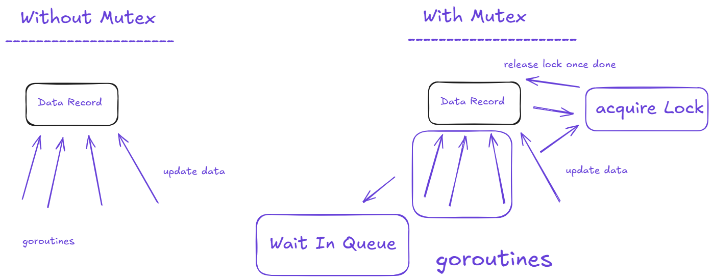

# Mutual Exclusion (Mutex)

When dealing with concurrency, we will have a classical condition called `Race Condition` , what exactly is race condition

when two goroutines try to update the same data variable we might enter a situation where they both try to update the record at the same time, this results in skipping updates to the data some times and deadlocks as well.

To avoid this we have a concept called `Mutual Exclusion` aka `Mutex` , what this will do is Mutex will lock the record when a goroutine accessed it that means it will not allow another goroutine to touch the record until the lock is released, this will ensure the data is updated no matter what teh goroutines wait in queue to update the data record acquires the lock updates it and then releases it

we can see if a go file has race condition causing code or not with below command

```bash
go run --race file.go
```


